<div align="center">


<h1>FinOps Showback Tool (FST)</h1>

<p><strong>The Global Standard for Industrialized Cloud Cost Visibility, Allocation, and Financial Accountability</strong></p>

[]()
[]()
[]()
[]()

<br/>

> **"Democratizing cloud economics to drive engineering accountability, finance transparency, and business value realization across the modern enterprise."** 
> The FinOps Showback Tool (FST) is a flagship repository designed to collect, normalize, allocate, and visualize technology costs across heterogeneous cloud and SaaS estates.

</div>

---

## 🏛️ Executive Summary

**FinOps Showback Tool (FST)** is a flagship platform designed for CIOs, CFOs, and FinOps practitioners. As enterprise technology spend shifts from capital expenditure (CapEx) to operating expenditure (OpEx), the ability to accurately attribute costs to business value is critical. FST industrializes the "Showback" process—providing every team, business unit, and product owner with a clear, verified statement of their cloud and technology consumption.

This platform provides an industrialized approach to **Cloud Financial Visibility**, delivering production-ready **Allocation Engines**, **Billing Normalizers**, **Statement Generators**, and **Executive Dashboards**. It enables organizations to move beyond simple billing reports to sophisticated **Unit Economics**, **Shared Cost Allocation**, and **Commitment Benefit Distribution**, ensuring full financial transparency and engineering accountability.

---

## 💡 Why Showback Matters

Showback is the first and most critical step in the FinOps maturity journey:
- **Driving Accountability**: When teams see the direct cost of their architectural decisions, they are naturally incentivized to optimize.
- **Financial Transparency**: Providing the CFO organization with a verified link between technology spend and business outcomes.
- **Data-Driven Decision Making**: Enabling product owners to calculate the true margin and profitability of their digital services.
- **Culture of Cost-Awareness**: Shifting the engineering mindset from "Unlimited Resources" to "Value-Based Consumption."

---

## 🚀 Business Outcomes

### 🎯 Strategic Transparency Impact
- **100% Cost Allocation**: Ensuring every dollar of cloud and SaaS spend is attributed to a specific cost center or product line.
- **Improved Gross Margin**: Identifying high-cost features and driving optimization to improve the bottom line.
- **Reduced Budget Variance**: Providing real-time visibility that allows teams to adjust spending before budget breaches occur.
- **Accelerated Value Realization**: Linking cloud investments directly to KPIs like "Cost per Transaction" or "Cost per User."

---

## 🏗️ Technical Stack

| Layer | Technology | Rationale |
|---|---|---|
| **Backend** | Python (FastAPI) | High-performance gateway for billing ingestion, normalization, and allocation logic. |
| **Data Engine** | Pandas / NumPy | Robust libraries for processing multi-million row billing datasets and complex allocation models. |
| **Frontend** | React 18, Vite | Premium portal for executive dashboards, team statements, and unit economics visualization. |
| **Persistence** | PostgreSQL | Relational metadata store for team hierarchies, allocation rules, and historical statements. |
| **Orchestration** | Redis / Workers | Managing long-running ETL pipelines and batch statement generation. |

---

## 📐 Architecture Storytelling: 90+ Diagrams

### 1. Executive High-Level Architecture
The holistic vision of the enterprise FinOps showback journey.

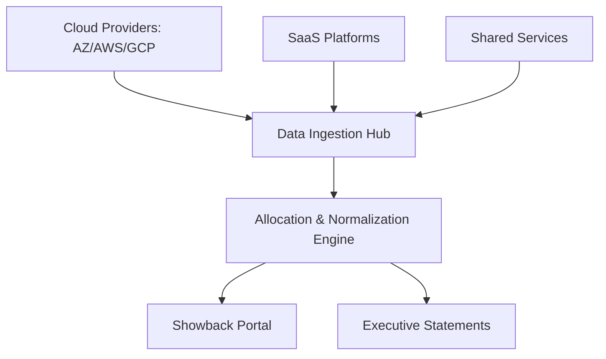

### 2. Detailed Platform Topology
The internal service boundaries and management layers of the industrialized FST platform.

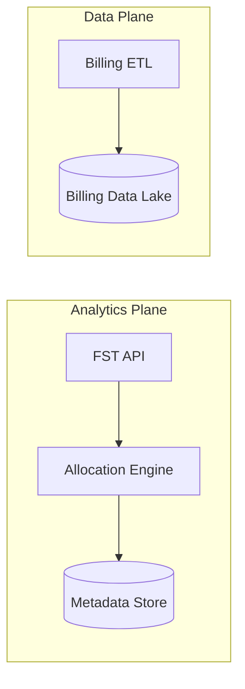

### 3. Billing Data to Report Path
Tracing the path from a raw billing event to a verified team showback statement.

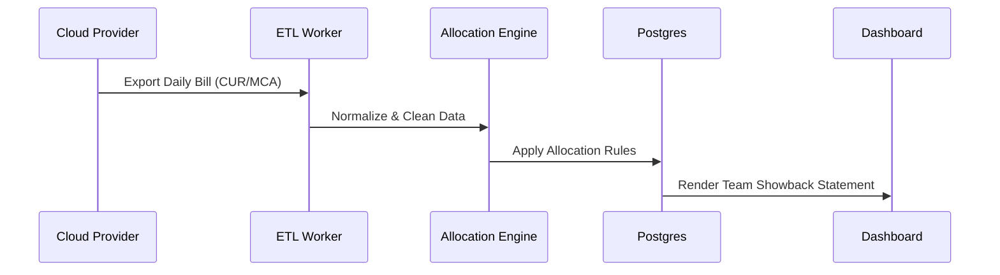

### 4. Showback Control Plane
The "Brain" of the framework managing global institutional standards and automated allocation workflows.

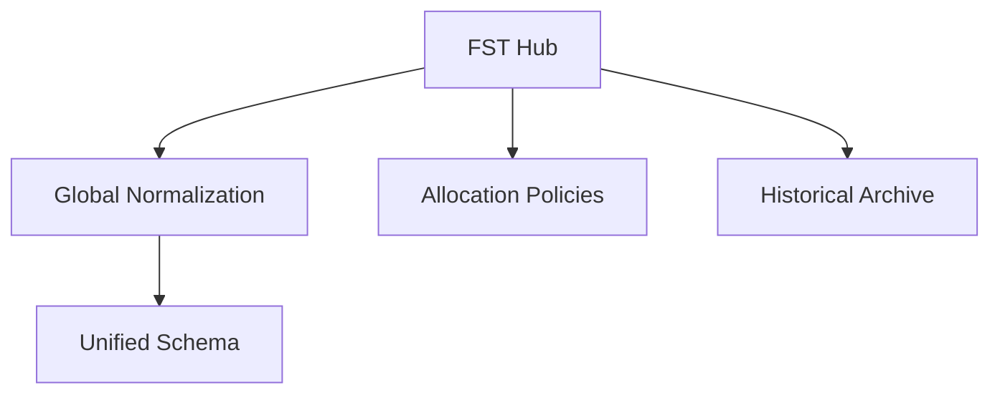

### 5. Multi-Cloud Topology
Synchronizing billing schemas across Azure, AWS, and GCP for a unified institutional view.

```mermaid
graph LR
    Azure[Azure MCA] <-> Bridge[FST Normalizer] <-> AWS[AWS CUR]
    Bridge <-> GCP[GCP Export]
```

### 6. Regional Deployment Model
Hosting reporting nodes close to global financial hubs for localized compliance and speed.

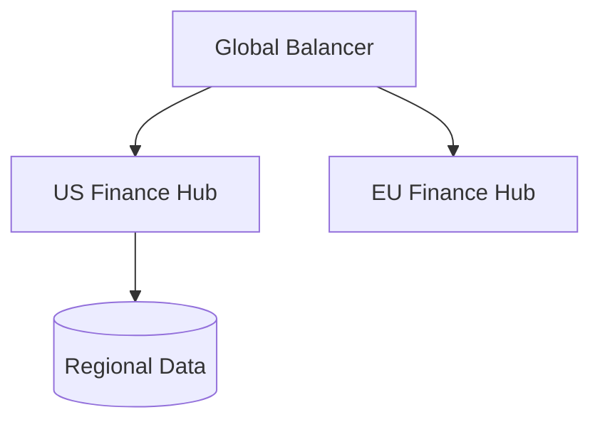

### 7. DR Failover Model
Ensuring platform continuity for critical month-end financial reporting and statements.

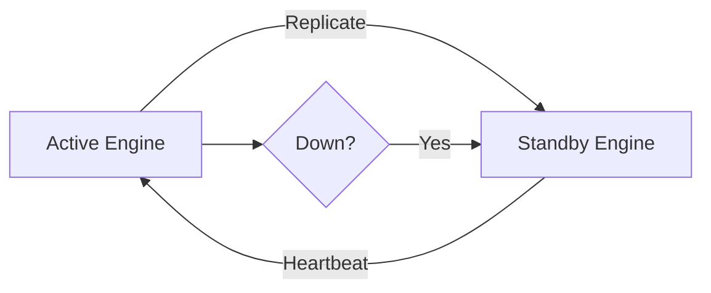

### 8. API Gateway Architecture
Securing and throttling the entry point for billing queries and allocation updates.

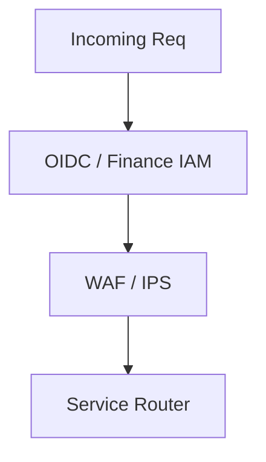

### 9. Queue Worker Architecture
Managing long-running billing syncs, allocation jobs, and statement generation.

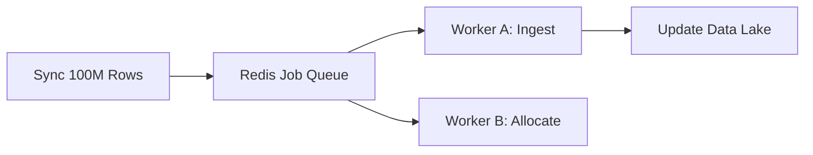

### 10. Dashboard Analytics Flow
How raw billing telemetry becomes executive institutional cost heatmaps.

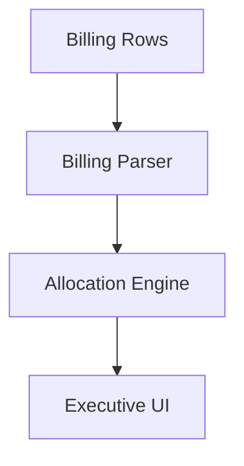

### 11. Showback Operating Model
Defining the institutional roles and responsibilities for cloud cost transparency.

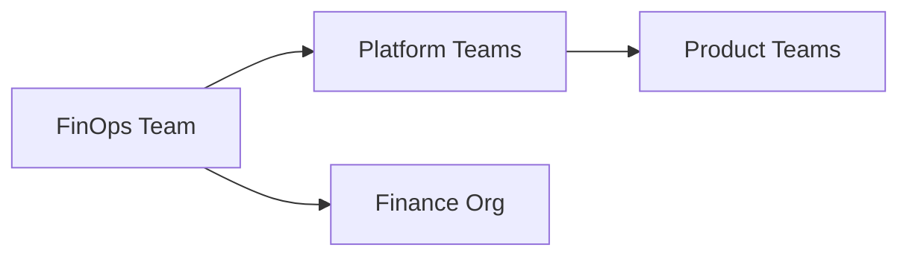

### 12. Finance + Engineering Cadence
Standardizing the rhythm of monthly billing reviews and budget reconciliations.

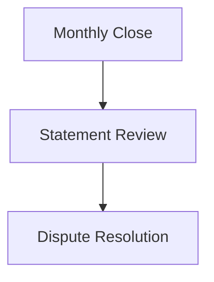

### 13. Team Ownership Map
Mapping cloud resource identifiers (subscriptions/accounts) to organizational owners.

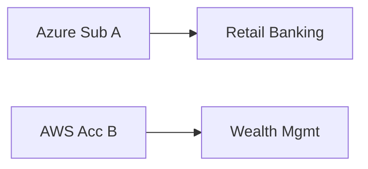

### 14. Cost Center Alignment Flow
Synchronizing technical resource tags with the enterprise General Ledger.

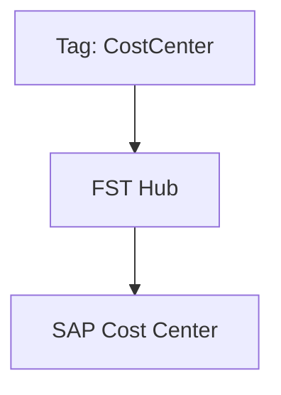

### 15. Allocation Approval Workflow
The institutional process for validating and approving shared cost models.

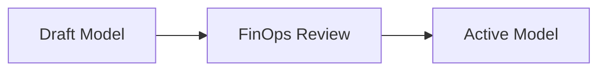

### 16. Monthly Close Process
The automated sequence for finalizing the monthly showback cycle.

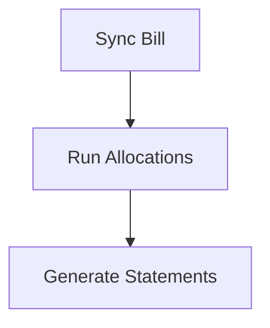

### 17. KPI Governance Cadence
The formal schedule for reviewing showback accuracy and coverage metrics.

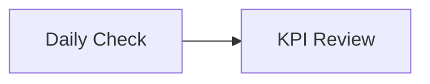

### 18. Quarterly Business Review Model
Reporting showback insights and cost optimization outcomes to leadership.

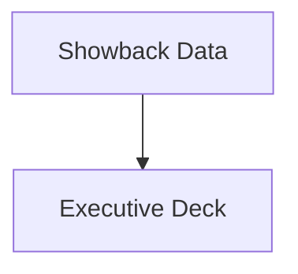

### 19. Executive Steering Committee
The governing body for enterprise showback strategy and policy alignment.

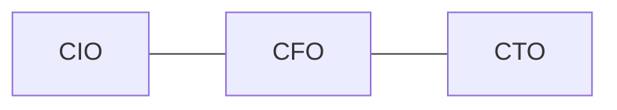

### 20. FinOps Community of Practice
The grass-roots forum for sharing showback best practices and success stories.

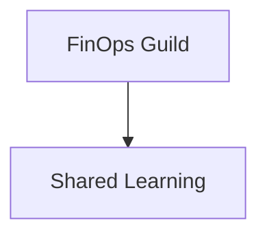

### 21. Direct Cost Allocation Workflow
The simple path for attributing costs directly to their technical owners.

```mermaid
graph LR
    Usage[Direct Usage] --> Bill[Team Bill]
```

### 22. Shared Cost Allocation Model
Fairly distributing common costs (e.g., Shared DBs, Network) across spokes.

```mermaid
graph TD
    Shared[Shared Service] --> Pro-rata[Usage %] --> Spokes[Teams]
```

### 23. Headcount Allocation Method
Allocating fixed technology costs based on the number of users in a department.

```mermaid
graph LR
    Total[$1M] / FTE[100] = Alloc[$10k/FTE]
```

### 24. Revenue-based Allocation Model
Attributing platform costs proportional to the revenue generated by a product.

```mermaid
graph TD
    Platform[Platform Cost] --> RevRatio[Revenue Share] --> Product[Product Cost]
```

### 25. Usage-based Allocation Workflow
Allocating shared resource costs (e.g., Snowflake, K8s) based on actual consumption.

```mermaid
graph LR
    Telemetry[Query Count] --> Alloc[Weighted Cost]
```

### 26. Environment Split Model
Visualizing the cost distribution between Dev, Test, UAT, and Production.

```mermaid
graph TD
    Total[Total] --> Dev[10%]
    Total --> Prod[70%]
```

### 27. Commitment Benefit Allocation
Distributing RI and Savings Plan discounts back to the teams that earned them.

```mermaid
graph LR
    Central[Purchased RI] --> Apportion[Match Usage] --> Team[Team Savings]
```

### 28. Support Cost Allocation Model
Distributing cloud provider support fees (pro-rata) across all business units.

```mermaid
graph TD
    Fee[Support Fee] --> Alloc[Pro-rata Spend] --> BU[BU Statement]
```

### 29. Marketplace Cost Allocation
Ensuring 3rd party software spend is correctly attributed to the purchasing team.

```mermaid
graph LR
    Buy[Marketplace Buy] --> Project[Project Code] --> Bill[Statement]
```

### 30. Multi-currency Normalization
Converting global spend across different currencies into a single reporting currency.

```mermaid
graph TD
    GBP[GBP] --- USD[USD Hub] --- EUR[EUR]
```

### 31. Budget Variance Workflow
Identifying and explaining the "Why" behind spend deviations from the plan.

```mermaid
graph LR
    Actual[Actual] <-> Budget[Budget] --> Variance[Analyze]
```

### 32. Forecasting Process Flow
Predicting future spend based on historical trends and engineering roadmaps.

```mermaid
graph TD
    History[History] + Roadmap[New Load] --> Forecast[Future View]
```

### 33. Cost Anomaly Detection Model
Identifying and alerting on unexpected spend spikes in near real-time.

```mermaid
graph LR
    Live[Live Bill] <-> ML[Baseline] --> Spike[Alert]
```

### 34. Unit Economics Waterfall
Breaking down total cloud spend into specific units of business value.

```mermaid
graph TD
    Total[$10M] --> PerUser[$0.50]
```

### 35. Cost per Customer Model
Determining the technical cost of serving an individual enterprise client.

```mermaid
graph LR
    Usage[Telemetry] / CustCount[Customers] = CostPerCust[Metric]
```

### 36. Cost per Transaction Model
Measuring the cloud efficiency of specific business operations (e.g., Order Placed).

```mermaid
graph TD
    OrderSvc[Cloud Cost] / Orders[Orders] = UnitCost[Score]
```

### 37. Margin Influence Map
Visualizing how cloud optimization efforts directly impact product profitability.

```mermaid
graph LR
    Save[Save $1M] --> Profit[+5% Margin]
```

### 38. Trend Seasonality Model
Accounting for predictable spikes (e.g., Black Friday) in showback reports.

```mermaid
graph TD
    Dec[Peak] --- Feb[Baseline]
```

### 39. Benchmark Comparison Flow
Comparing a team's showback metrics against peers and industry standards.

```mermaid
graph LR
    TeamA[Our Team] <-> TeamB[Peer Avg]
```

### 40. Optimization Opportunity Funnel
Filtering the raw billing data into prioritized, actionable savings tasks.

```mermaid
graph TD
    Raw[All Spend] --> Filter[Low Utilization] --> Task[Rightsize!]
```

### 41. Kubernetes Namespace Allocation
Breaking down shared cluster costs into namespaces, pods, and labels.

```mermaid
graph LR
    NodePool[Compute] --> NS[Namespace] --> App[Owner]
```

### 42. Cluster Shared Cost Model
Distributing the cost of system services (kube-system) across all tenants.

```mermaid
graph TD
    System[Control Plane] --> Alloc[Pro-rata Tenant]
```

### 43. CI/CD Spend Visibility Flow
Tracking the cost of build pipelines and developer environments per project.

```mermaid
graph LR
    Workflow[GH Actions] --> Runner[Cost] --> Project[Team A]
```

### 44. Environment Lifecycle Cost Model
Measuring the total cost of ownership (TCO) for temporary environments.

```mermaid
graph TD
    UAT[UAT Start] --> Cost[Active Spend] --> End[Cleanup]
```

### 45. Dev/Test Shutdown Automation
Reporting on the savings generated by automated off-hours shutdowns.

```mermaid
graph LR
    7PM[Off] --> Savings[Saved $200]
```

### 46. Rightsizing Workflow
Tracking the showback impact of downsizing oversized resources.

```mermaid
graph TD
    Oversized[2xlarge] --> Rightsize[large] --> Save[Impact]
```

### 47. Storage Tier Optimization
Reporting on the movement of data to lower-cost archival tiers.

```mermaid
graph LR
    Hot[Hot] --> Archive[Archive] --> ReducedCost[Metric]
```

### 48. Data Platform Allocation Model
Governing the spend of shared data platforms (Snowflake, Databricks).

```mermaid
graph TD
    Credit[Credit Pool] --> Query[User A] --> BU[Finance Bill]
```

### 49. Network Egress Governance
Identifying and attributing high-cost cross-region data transfers.

```mermaid
graph LR
    Traffic[Egress] --> Tag[Source App] --> Showback[Team Bill]
```

### 50. Architecture Review for Cost
Integrating cost showback projections into the standard architecture review process.

```mermaid
graph TD
    Design[Design] --> ProjectCost[Estimate] --> Approve[Go-Live]
```

### 51. Executive KPI Review Cycle
Providing the C-suite with a unified view of showback accuracy and coverage.

```mermaid
graph LR
    KPI[Allocated %] --> Exec[Exec Report]
```

### 52. Unit Cost Scorecard
Reporting the cost per business unit (e.g., Cost per Hotel Booking).

```mermaid
graph TD
    Cost[Spend] / Unit[Units] = Scorecard[Metric]
```

### 53. Team Benchmark Comparison
Gamifying FinOps showback by comparing efficiency scores of different teams.

```mermaid
graph LR
    TeamA[Leader] <-> TeamB[Lagging]
```

### 54. BU Heatmap Model
Identifying which business units are driving the most spend and growth.

```mermaid
graph TD
    Retail[Hot] --- Ops[Cool]
```

### 55. Forecast Accuracy Dashboard
Measuring the deviation between predicted spend and actual showback billing.

```mermaid
graph LR
    Actual[Actual] <-> Forecast[Forecast] --> Variance[1.2%]
```

### 56. Monthly Statement Generation
The automated flow for creating PDF and portal statements for every team.

```mermaid
graph TD
    Data[Data] --> Template[Monthly View] --> PDF[Statement]
```

### 57. Sustainability Cost Dashboard
Mapping cloud spend to carbon footprint for corporate ESG reporting.

```mermaid
graph LR
    Spend[Spend] --> Carbon[CO2 Metric]
```

### 58. Value Realization Model
Measuring the ROI of cloud migrations and technology modernizations.

```mermaid
graph TD
    Cost[Migration Cost] <-> Benefit[Value Gained]
```

### 59. Savings Attribution Model
Correcting attributing realized savings to specific optimization projects.

```mermaid
graph LR
    Action[Rightsize] --> Benefit[Saved $10k] --> Team[Team Credit]
```

### 60. Product Profitability Model
Linking cloud showback costs to product revenue for a true margin view.

```mermaid
graph TD
    Rev[Revenue] - Cost[Cloud Bill] = Margin[Profit]
```

### 61. Metrics Pipeline
The automated flow for capturing, processing, and storing showback metrics.

```mermaid
graph LR
    Ingest[Ingest] --> Process[Process] --> Store[Store]
```

### 62. Logging Architecture
The multi-layered approach to capturing showback platform activity and audit.

```mermaid
graph TD
    Auth[Auth] --- API[API] --- Sync[Sync]
```

### 63. Tracing Model
Observing the path of long-running billing syncs and allocation jobs.

```mermaid
graph LR
    Req[Req] --> Queue[Redis] --> Worker[Engine]
```

### 64. Data Quality Workflow
Automating the verification of billing data integrity and completeness.

```mermaid
graph TD
    Data[Data] --> Check[Valid?] --> Proceed[Process]
```

### 65. Access Governance Model
Defining who can see specific showback statements (RBAC).

```mermaid
graph LR
    Role[Manager] --> Perm[View Team Spend]
```

### 66. Policy Approval Workflow
The institutional process for defining new showback allocation rules.

```mermaid
graph TD
    Proposed[Proposed] --> Review[Board] --> Active[Active]
```

### 67. Change Management Cycle
Governing updates to the showback analytics platform and forecasting models.

```mermaid
graph LR
    Dev[Dev] --> Test[UAT] --> Release[Prod]
```

### 68. Runbook Escalation Model
The automated response path for showback data ingestion failures.

```mermaid
graph TD
    Fail[Sync Fail] --> Pager[Alert] --> Triage[On-Call]
```

### 69. FinOps Maturity Roadmap
The journey from "Basic Showback" to "Elite Unit Economics."

```mermaid
graph LR
    Crawl[Visibility] --> Run[Unit Econ]
```

### 70. Continuous Improvement Loop
Evolving showback dashboards based on stakeholder feedback.

```mermaid
graph TD
    Retro[Retro] --> Update[Dash Update]
```

### 71. AI Allocation Advisor Flow
Using LLMs to suggest the best allocation models for unassigned costs.

```mermaid
graph LR
    Scan[Analyze Spend] --> AI[AI Advice] --> Rule[New Rule]
```

### 72. Autonomous Optimization Engine
Reporting on the performance of self-healing cloud infrastructure.

```mermaid
graph TD
    AI[AI] --> AutoAction[Scale Down]
```

### 73. Multi-country Operating Model
Governing showback across different tax jurisdictions and currencies.

```mermaid
graph LR
    Global[Global Hub] --> Local[Regional Entity]
```

### 74. M&A Spend Integration Flow
Rapidly onboarding and auditing the showback of acquired companies.

```mermaid
graph TD
    Acq[Acquired Co] --> Audit[Audit] --> Merge[Sync]
```

### 75. Sovereign Cloud Billing Model
Managing showback in restricted regions with localized invoicing.

```mermaid
graph LR
    Gov[Sovereign] --> LocalBill[Local Currency]
```

### 76. Carbon + Cost Optimization Model
Identifying "Green Optimization" targets that reduce both cost and CO2.

```mermaid
graph TD
    Save[$] <-> Green[Carbon]
```

### 77. Developer Nudging Workflow
Automating the "soft enforcement" of FinOps showback via Slack.

```mermaid
graph LR
    Violation[Drift] --> Nudge[Slack Message]
```

### 78. Real-time Spend Streaming Model
Using streaming data to provide second-by-second showback visibility.

```mermaid
graph TD
    Event[Event] --> Stream[Kafka] --> Dash[Real-time]
```

### 79. Innovation Portfolio Roadmap
Planning the next 36 months of showback platform evolution.

```mermaid
graph LR
    Year1[Visibility] --> Year3[AI-Unit-Econ]
```

### 80. Strategic Transformation Timeline
The multi-year mission to instill showback culture across the enterprise.

```mermaid
graph TD
    Phase1[Setup] --> Phase3[Culture]
```

### 81. Terraform Demo Environment Flow
Automating the creation of sample cloud estates for showback training.

```mermaid
graph LR
    Req[Req] --> TF[Provision] --> Demo[Live Estate]
```

### 82. Queue Processing Lifecycle
Ensuring high-availability for background billing syncs and reports.

```mermaid
graph TD
    Task[Task] --> Worker[Worker] --> Success[Ack]
```

### 83. Backup Recovery Model
Governing the protection and testing of historical showback and analytics data.

```mermaid
graph LR
    Active[Active] --> Snap[Snap] --> Test[Monthly]
```

### 84. ERP Integration Workflow
Synchronizing showback statements with corporate finance systems (SAP/Oracle).

```mermaid
graph TD
    FST[FST Hub] --> ERP[SAP] --> Accounting[Ledger]
```

### 85. CMDB Sync Model
Linking cloud resources to the corporate Configuration Management Database.

```mermaid
graph LR
    Cloud[Resource] <-> CMDB[System ID]
```

### 86. SaaS Telemetry Flow
Capturing and analyzing usage data from SaaS providers (Salesforce, Slack).

```mermaid
graph TD
    SaaS[API] --> Usage[Process] --> Opt[Rationalize]
```

### 87. Data Retention Governance
Enforcing institutional policies for historical showback data aging.

```mermaid
graph LR
    Hot[12mo] --> Cold[7yr Archive]
```

### 88. Tenant Baseline Comparison
Auditing individual business units against the enterprise efficiency baseline.

```mermaid
graph TD
    Gold[Enterprise Gold] <-> BU[Business Unit]
```

### 89. PMO Operating Model
The institutional structure for the central FinOps Project Management Office.

```mermaid
graph LR
    PMO[PMO] --- Teams[Teams]
```

### 90. Global FinOps Hub Model
The institutional structure for 24/7 global showback operations.

```mermaid
graph LR
    Follow[Follow the Sun] --- Hub[FinOps Hub]
```

---

## 🔬 FinOps Showback Methodology

### 1. The FST Pillars
Our platform is built on four core pillars:
- **Transparency**: 100% visibility into every dollar spent across cloud and SaaS.
- **Accountability**: Engineering ownership of cost through verified showback statements.
- **Allocation**: Fair and defensible distribution of shared technology costs.
- **Value**: Transitioning from "Saving Money" to "Making Money" through unit economics.

### 2. Communication Strategy
We provide a strategic framework for shifting the organization from "Bill Shock" to "Continuous Optimization."

---

## 🚦 Getting Started

### 1. Prerequisites
- **Azure / AWS / GCP** billing access.
- **Terraform** (latest version).
- **Python** (3.11+) for the analytics engine.

### 2. Local Setup
```bash
# Clone the repository
git clone https://github.com/Devopstrio/finops-showback-tool.git
cd finops-showback-tool

# Start the Showback Control Plane
docker-compose up --build
```
Access the Portal at `http://localhost:3000`.

---

## 🛡️ Governance & Security
- **Data Integrity**: Automated verification of billing data from source to statement.
- **Institutional RBAC**: Granular access control for spend visibility.
- **Audit Ready**: Built-in evidence generation for financial audits.

---
<sub>&copy; 2026 Devopstrio &mdash; Engineering the Future of Industrialized FinOps Showback.</sub>
