<div align="center">


<h1>FinOps Showback Tool</h1>

<p><strong>The Institutional-Grade Platform for Cloud Cost Intelligence, Multi-Cloud Allocation, and Financial Accountability Orchestration.</strong></p>

[]()
[]()
[]()

<br/>

> **"Industrializing cloud economics to democratize cost visibility."** 
> **FinOps Showback Tool** is an enterprise-grade platform designed to provide a secure, measurable, and highly automated foundation for global cloud financial operations. It orchestrates the complex lifecycle of cost management—from billing ingestion and tag-driven attribution to distributed multi-cloud allocation and unified financial auditing.

</div>

---

## 🏛️ Executive Summary

Fragmented billing silos and manual cost attribution workflows are strategic operational liabilities; lack of centralized cost orchestration is a primary barrier to organizational FinOps maturity. Organizations fail to maintain a secure financial foundation not because of a lack of bills, but because of fragmented tagging standards, lack of automated allocation validation, and an inability to orchestrate cost planes with operational precision.

This platform provides the **Cost Intelligence Plane**. It implements a complete **Enterprise FinOps-as-Code Framework**, enabling Finance and Engineering teams to manage global cloud economics as first-class citizens. By automating the identification of spend bottlenecks through real-time telemetry analysis and orchestrating the deployment of secure attribution-driven showback policies, we ensure that every organizational service—from core database clusters to distributed regional workloads—is governed by default, audited for history, and strictly aligned with institutional financial frameworks.

---

## 📐 Architecture Storytelling: Principal Reference Models

### 1. Principal Architecture: Global FinOps Showback & Cost Intelligence Plane
This diagram illustrates the end-to-end flow from multi-cloud billing ingestion and tag orchestration to cost center allocation, safety validation, and institutional financial auditing.

```mermaid
graph LR
    %% Subgraph Definitions
    subgraph BillingIngress["Cloud Billing & Usage Ingress"]
        direction TB
        Cloud_Cur_MCA["CUR / MCA / GCP Exports"]
        SaaS_Usage["SaaS Platform Usage Logs"]
        Shared_Services["Shared Infrastructure Costs"]
    end

    subgraph IntelligenceEngine["Cost Intelligence Hub"]
        direction TB
        API["FastAPI Showback Gateway"]
        AllocationOrchestrator["Global Allocation & Attribution Hub"]
        TagGuard_Hub["Tagging Governance & Mapping Hub"]
        AIOps_Validator["Anomaly & Drift Analysis Hub"]
    end

    subgraph OperationsPlane["Distributed Multi-Cloud Fleet"]
        direction TB
        AzureMCA["Managed Azure Billing Hubs"]
        AWSCUR["Managed AWS Billing Hubs"]
        GCPExport["Managed GCP Billing Hubs"]
    end

    subgraph OperationsHub["Institutional Finance Hub"]
        direction TB
        Scorecard["FinOps Maturity Scorecard"]
        Analytics["Spend Flow & Unit Economic Stats"]
        Audit["Forensic Cost Metadata Lake"]
    end

    subgraph DevOps["FinOps-as-Code Framework"]
        direction TB
        TF["Terraform Cost Modules"]
        DriftBot["Tag & Config Drift Validator"]
        ChatOps["FinOps Operations Hub"]
    end

    %% Flow Arrows
    BillingIngress -->|1. Submit Billing Data| API
    API -->|2. Orchestrate Allocation| AllocationOrchestrator
    AllocationOrchestrator -->|3. Apply Tag Policy| TagGuard_Hub
    TagGuard_Hub -->|4. Assess Drift| AIOps_Validator
    
    AIOps_Validator -->|5. Execute Provision| OperationsPlane
    OperationsPlane -->|6. Notify Status| ChatOps
    API -->|7. Visualize Health| Scorecard
    
    Scorecard -->|8. Track Maturity| Analytics
    Scorecard -->|9. Record Provision| Audit
    
    TF -->|10. Provision Backbone| IntelligenceEngine
    DriftBot -->|11. Inject Cost Risk| AllocationOrchestrator
    Audit -->|12. Improve Operations| AzureMCA

    %% Styling
    classDef ingress fill:#f5f5f5,stroke:#616161,stroke-width:2px;
    classDef intel fill:#e8eaf6,stroke:#1a237e,stroke-width:2px;
    classDef operations fill:#e1f5fe,stroke:#01579b,stroke-width:2px;
    classDef ops fill:#ede7f6,stroke:#311b92,stroke-width:2px;
    classDef devops fill:#e8f5e9,stroke:#1b5e20,stroke-width:2px;

    class BillingIngress ingress;
    class IntelligenceEngine intel;
    class OperationsPlane operations;
    class OperationsHub ops;
    class DevOps devops;
```

### 2. The FinOps Showback Lifecycle Flow
The continuous path of a cloud cost record from initial ingest (billing) and categorize (tags) to active allocate (cost center), showback (dashboard), and institutional forensic auditing.

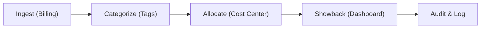

### 3. Distributed Cloud Cost Topology
Strategically orchestrating cost data across global cloud regions, multi-tenant accounts, and internal business units, providing a unified institutional view of global cloud health and cost readiness.

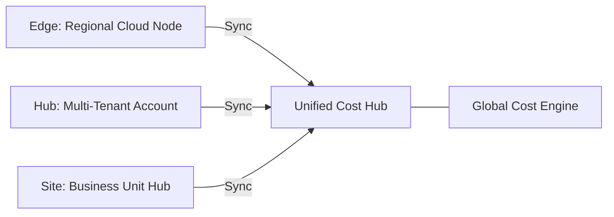

### 4. Tagging Governance & Cost Attribution Flow
Executing complex logic for securing the bridge between raw infrastructure consumption and institutional financial accountability, ensuring every organizational identity is verified and every cost access is according to institutional standards.

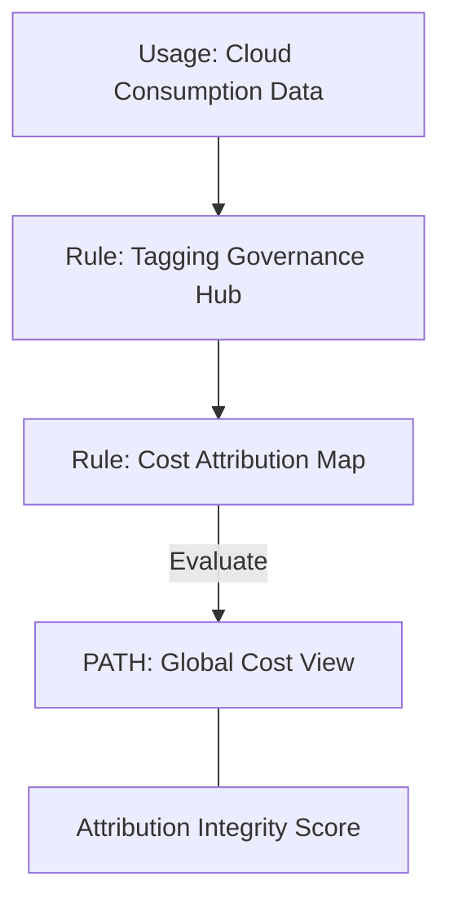

### 5. Multi-Cloud Billing Federation & Governance Flow
Automatically managing unified billing visibility across Azure, AWS, and GCP for global cloud estates, ensuring institutional data residency and security boundaries by default.

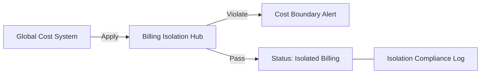

### 6. Encryption & Financial Data Protection Flow (Privacy Standard)
Managing the lifecycle of a financial record, automatically enforcing institutional encryption and privacy standards as required by security policy, ensuring zero-latency security confidence.

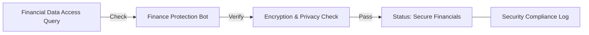

### 7. Institutional FinOps Maturity Scorecard
Grading organizational performance based on key indicators: Cost Visibility Grade, Unit Economics Index, and Forecasting Accuracy Index.

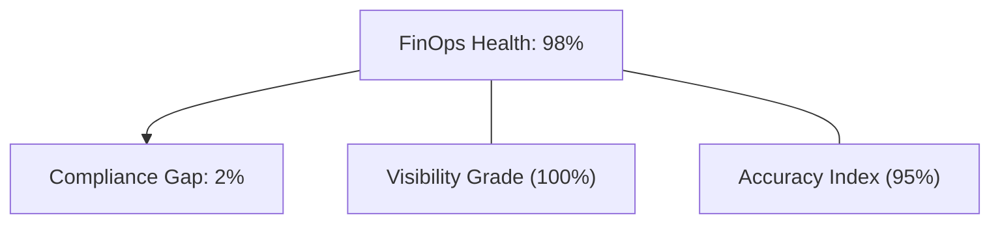

### 8. Identity & RBAC for FinOps Governance
Managing fine-grained access to cost hubs, provisioning workers, and audit logs between FinOps Leads, Product Owners, and Finance Analysts.

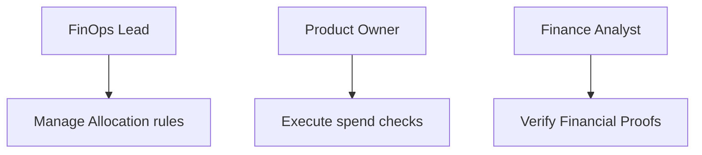

### 9. IaC Deployment: FinOps-as-Code Framework
Using modular Terraform to deploy and manage the versioned distribution of the cost tracking hubs, attribution protection workers, and forensic metadata lakes.

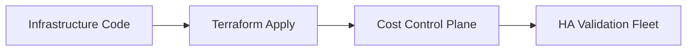

### 10. AIOps Cost Drift & Anomaly Validation Flow
Using advanced analytics to identify sudden surges in cloud spend, unauthorized resource provisioning, suspicious configuration drifts, or unusual cost pattern changes that could result in institutional risk.

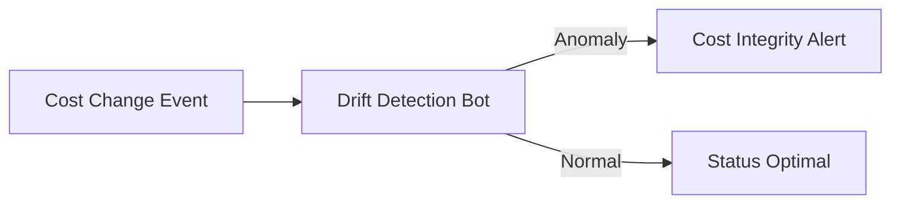

### 11. Metadata Lake for Forensic FinOps Audit
Storing long-term records of every billing record (metadata), every allocation change recorded, and every budget event for institutional record-keeping, compliance auditing, and post-provisioning forensics.

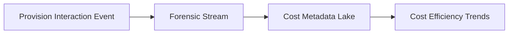

---

## 🏛️ Core Governance Pillars

1.  **Unified Foundation Coordination**: Maximizing resilience by centralizing all cost measurement through a single institutional plane.
2.  **Automated Billing Provisioning**: Eliminating "manual bill" scenarios through proactive orchestration and pattern verification.
3.  **Sequential Allocation Intelligence**: Ensuring zero-interruption operations through dependency-aware allocation-driven cost engineering.
4.  **Zero-Trust Cost Protection**: Automatically enforcing identity-based access and rule evaluation across all cost tiers.
5.  **Autonomous Operations Logic**: Guaranteeing reliability through automated industry-specific cost monitoring runbooks.
6.  **Full Cost Auditability**: Immutable recording of every allocation change and cost provision for institutional forensics.

---

## 🛠️ Technical Stack & Implementation

### Cost Engine & APIs
*   **Framework**: Python 3.11+ / FastAPI.
*   **Data Engine**: Pandas / NumPy based logic for multi-cloud cost provisioning and DORA-style unit metrics.
*   **Integrations**: Native connectors for Azure MCA, AWS CUR, and GCP Billing Export APIs.
*   **Persistence**: PostgreSQL (Cost Ledger) and Redis (Live Cost State).
*   **Auth Orchestrator**: Federated OIDC/SAML for least-privilege cost management access.

### Governance Dashboard (UI)
*   **Framework**: React 18 / Vite.
*   **Theme**: Dark, Teal, Indigo (Modern high-fidelity financial aesthetic).
*   **Visualization**: D3.js for cost topologies and Recharts for spend velocity analytics.

### Infrastructure & DevOps
*   **Runtime**: AWS EKS or Azure Kubernetes Service (AKS) for management plane.
*   **Cost Hub**: Managed event sourcing for immutable financial security timeline reconstruction.
*   **IaC**: Modular Terraform for deploying the FinOps landing zone and validation fleet.

---

## 🏗️ IaC Mapping (Module Structure)

| Module | Purpose | Real Services |
| :--- | :--- | :--- |
| **`infrastructure/cost_hub`** | Central management plane | EKS, PostgreSQL, Redis |
| **`infrastructure/allocators`** | Distributed allocation provisioners | Azure, AWS, GCP APIs |
| **`infrastructure/billing_pipes`** | Billing Ingestion Hubs | Webhooks, Lambda |
| **`infrastructure/auditing`** | Forensic cost sinks | S3, Athena, Quicksight |

---

## 🚀 Deployment Guide

### Local Principal Environment
```bash
# Clone the landing zone platform
git clone https://github.com/devopstrio/finops-showback-tool.git
cd finops-showback-tool

# Configure environment
cp .env.example .env

# Launch the FinOps stack
make init

# Trigger a mock billing ingestion and automated cost validation simulation
make simulate-cost
```

Access the Management Portal at `http://localhost:3000`.

---

## 📜 License
Distributed under the MIT License. See `LICENSE` for more information.

---
<div align="center">
  <p>© 2026 Devopstrio. All rights reserved.</p>
</div>
